# Komponen Sistem Operasi

## 1. Manajemen Proses 

__Manajemen proses__ adalah suatu cara atau tindakan dalam membagi, mengalokasikan program yang akan dieksekusi menjadi tidak berantakan dan berjalan dengan baik sebagai mana mestinya. Dalam fungsinya untuk mengembangkan dan meningkatkan derajat efisiensi dan efektivitas, manajemen proses juga merupakan salah satu perangkat kerja yang sangat potensial dalam upaya peningkatan nilai-nilai kepuasan konsumen.

### Manajemen proses pada windows dan linux :
#### Windows
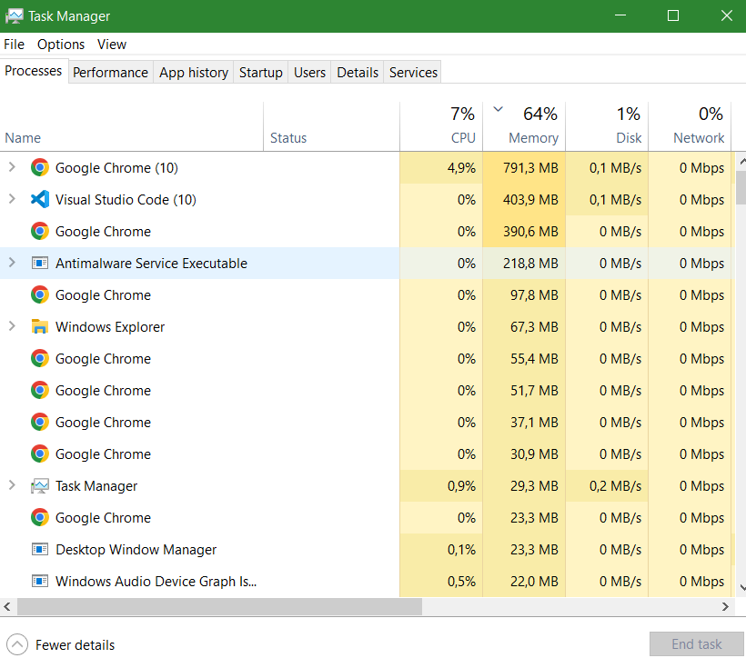

#### Linux
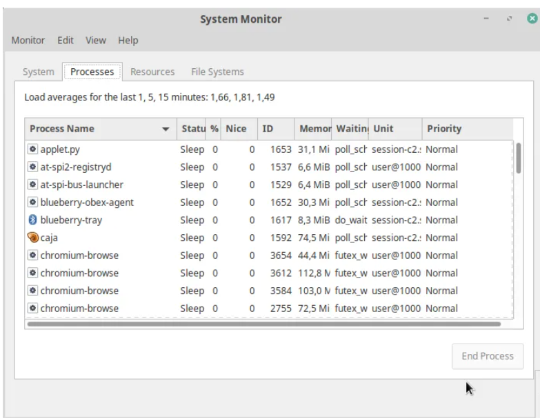

## 2.Manajemen Memori Utama

__Memori manajemen__ adalah tindakan mengelola memori komputer. Kebutuhan utama manajemen memori adalah untuk menyediakan cara untuk secara dinamis mengalokasikan bagian-bagian dari memori untuk program atas permintaan mereka, dan membebaskan untuk digunakan kembali ketika tidak lagi diperlukan. Ini sangat penting untuk setiap sistem komputer canggih di mana lebih dari satu proses mungkin berlangsung setiap saat.
### Manajemen memori utama pada windows dan linux :
#### Windows

#### Linux

Grafik menunjukan penggunaan memori pada komputer yang sedang kita gunakan.

## 3. Manajemen sistem Input Output (I/O)

I/O adalah suatu mekanisme pengiriman data secara bertahap dan terus menerus melalui suatu aliran data dari proses ke peranti (begitu pula sebaliknya). Fungsi I/O Pada dasarnya adalah mengimplementasikan algoritma I/O pada level aplikasi. Pada dasarnya, tugas utama komputer adalah processing dan I/O (Input danOutput). Bahkan sebagian besar waktunya digunakan untuk mengolah I/O sedangkan processing hanya bersifat insidental. Jadi, pada konteks I/O, peranan sistem operasi adalah mengatur dan mengontrol perangkat I/O dan operasi I/O.

### Manajemen i/o pada windows:
#### Windows
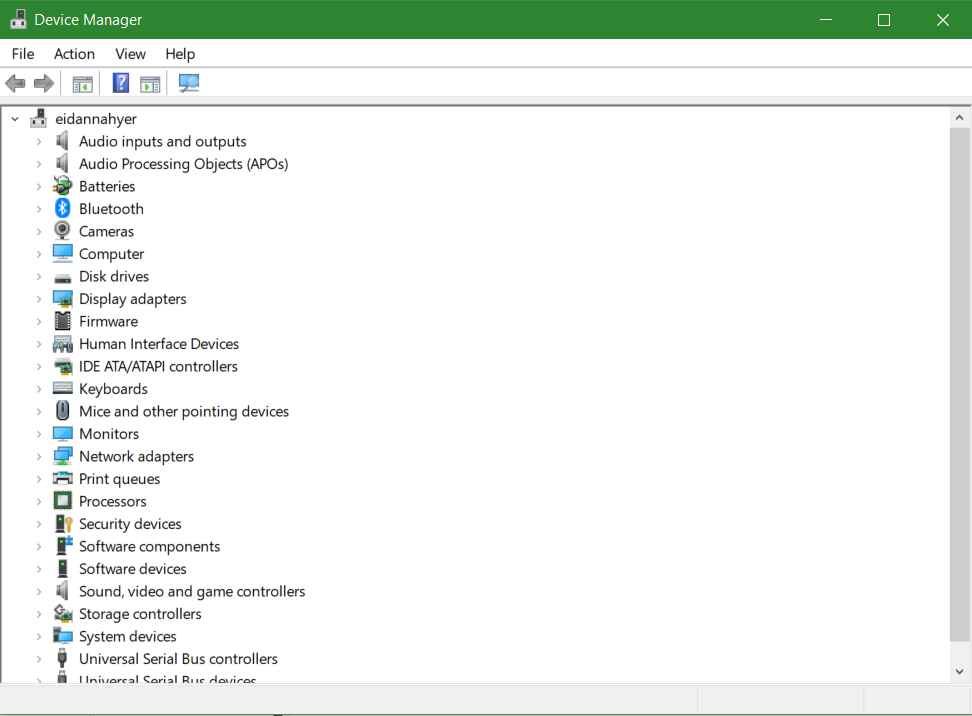

## 4. Manajemen sistem berkas

__Manajemen sistem berkas__ adalah sebuah metode dan struktur data yang digunakan oleh sistem operasi pada komputer untuk mengatur dan mengorganisir file yang ada pada disk atau partisi disk.

### Manajemen sistem berkas pada windows dan linux :
#### Windows

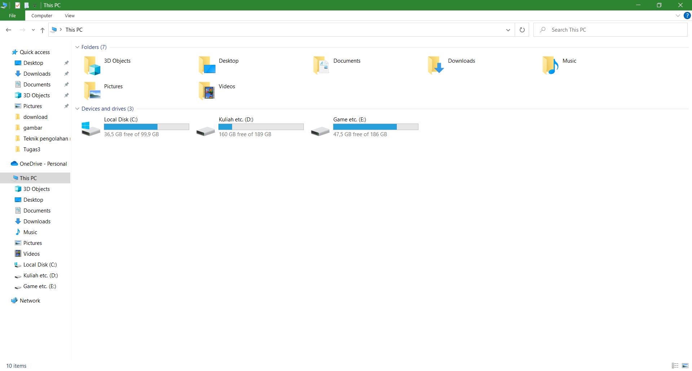

#### Linux
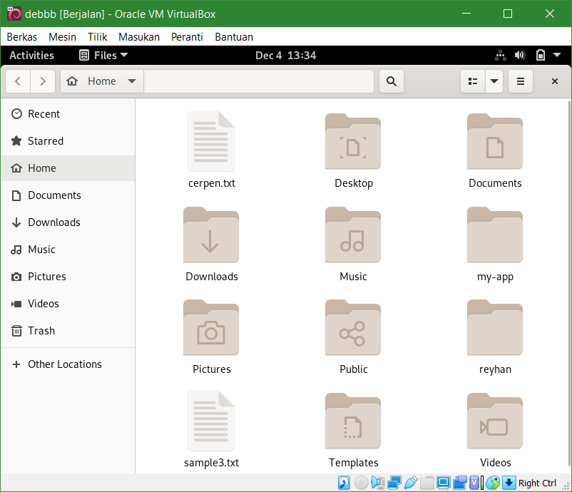

Diatas terlihat bahwa kita bisa mengatur menghapus memindahkan dan membuka file dan folder yang ada pada penyimpanan kita.

## 5. Eksekusi program
Eksekusi program pada adalah layanan yang diberikan atau disediakan oleh sistem operasi untuk menjalankan program yang ingin dibuka atau dijalankan.
### Eksekusi program pada windows
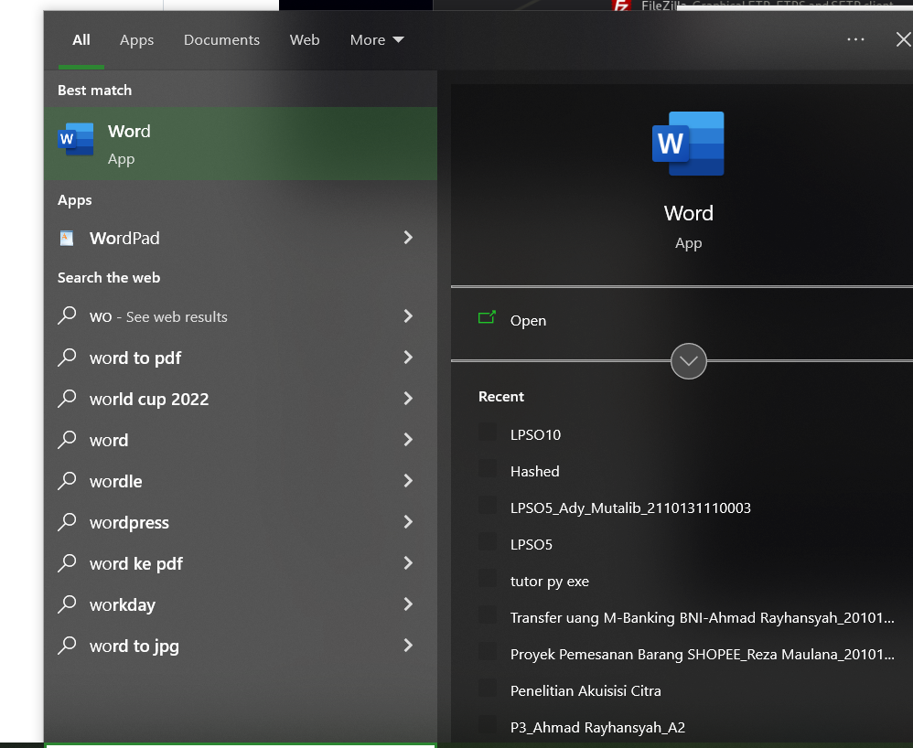
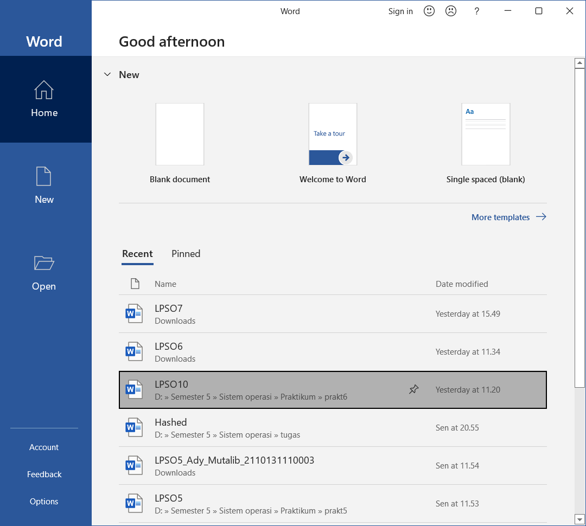

### Eksekusi program pada linux
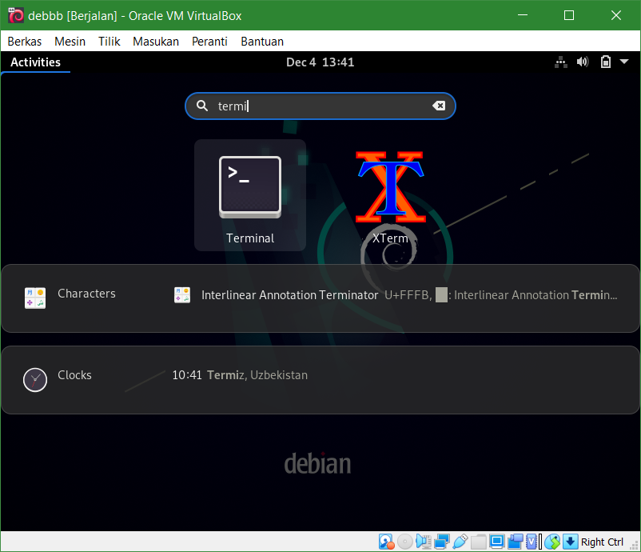
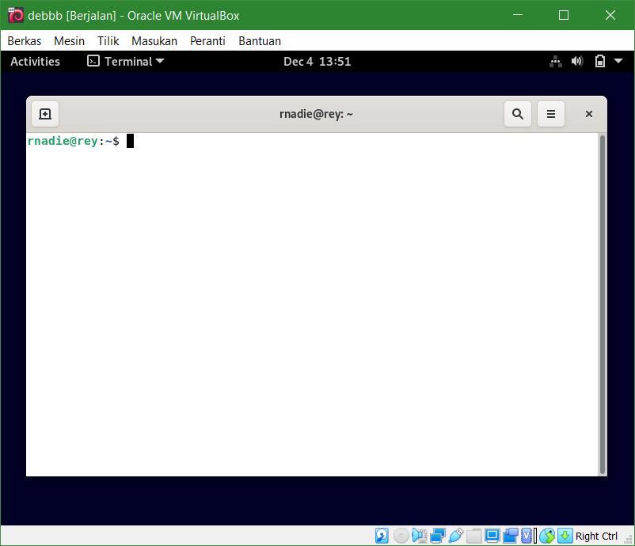

Terlihat pada kedua gambar diatas proses dari awal mencari aplikasi yang ingin dibuka hingga sampai aplikasi tersebut berhasil terbuka.

## 6. Manipulasi sistem berkas
Salah satu contoh manipulasi sistem berkas yaitu membuat folder, berikut adalah contoh pembuatan folder baru pada sistem berkas Windows dan Linux.

### Pada Windows

### Pada Linux
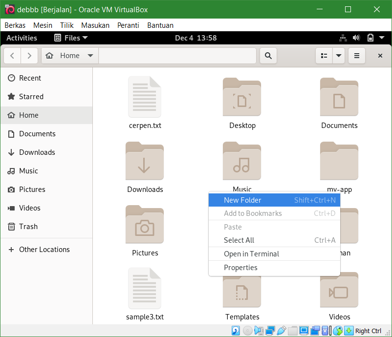

## 7. System call
Cara system call bekerja adalah sebagai berikut. Pertama-tama, user program akan mensetup argument untuk system call. Salah satu argumen adalah nomor system call. Perlu di catat bahwa semua ini dilakukan secara automatis oleh fungsi library kecuali jika kita menulis menggunakan bahasa assembler. Sesudah semua argumen di setup, program akan menjalankan instruksi "system call". Instruksi ini akan menyebabkan exception: event yang akan menyebabkan processor untuk jump ke satu address dan mulai menjalankan program / code di address tersebut.

Instruksi di alamat yang baru akan menyimpan state user program, menentukan sistem call apa yang kita inginkan, kemudian call fuction tersebut di kernel yang mengimplementasikan system call, setelah selesai maka mengembalikan program state, dan kembali ke user program. Sebuah system call adalah salah satu cara agar function yang di definisikan dalam device driver untuk bisa di panggil.

### System call pada windows
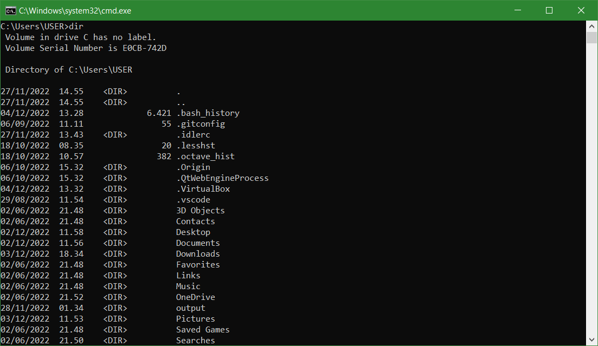
### System call pada linux
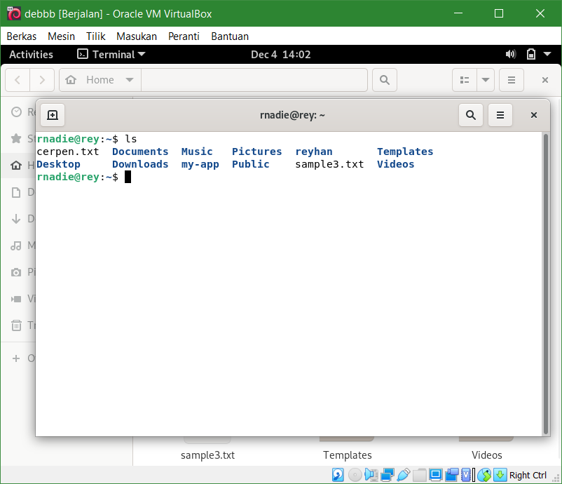

**"dir" pada windows dan "ls" pada linux adalah salah satu contoh system call yang berfungsi untuk menampilkan isi file atau folder apa saja yang ada pada penyimpanan direktori kita.**